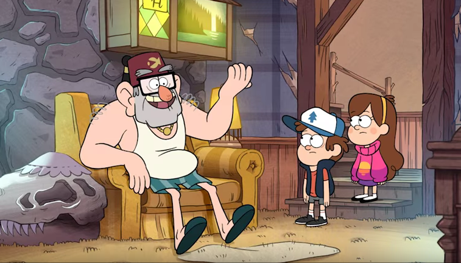
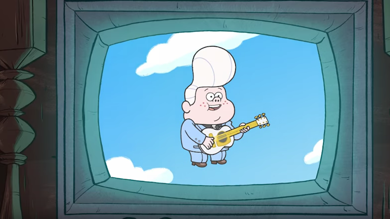
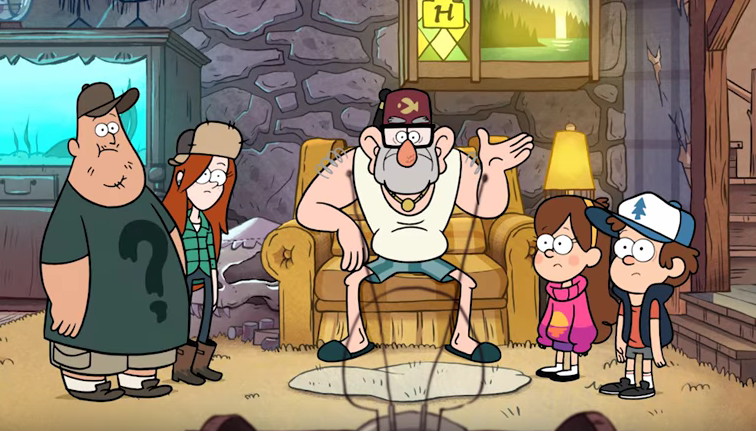
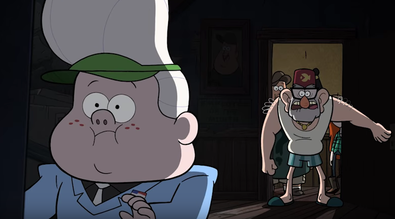
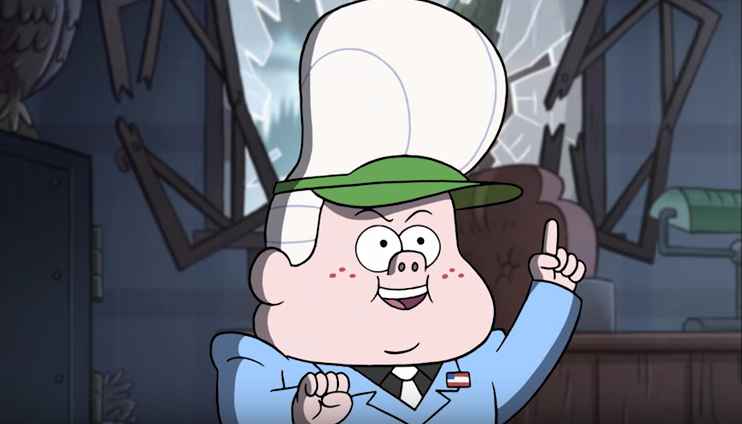
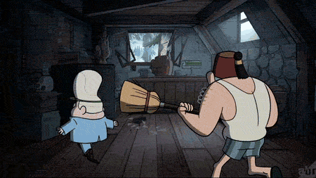

# Challenge : LosT Code [Read Solution](https://github.com/username/repo/blob/branch/docs/more_words.md)

  **Stan:** Kids! Come quick! I need you to laugh at this with me!
  **Gideon:**
*Who’s cute as a button*  *He’s pretty good*  *and always your friend?*  *Lil’ G-I-D to the E-O-N!*  *Wink!* 
**Dipper:** Gideon?!  **Mabel:** Gideon… Remember when I wouldn’t date him and he tried to destroy us?  **Stan:** He’s always trying to trick me into losing the Mystery Shack.  **Wendy:** One time I caught him stealing my moisturizer.  **Soos:** And yet, our mutual hatred for him bonds us together.  **On television, voice-over:** Come on down to Li’l Gideon’s Tent of Telepathy, opening soon at this location.  **Dipper:** Uh, should we be worried about that?  **Stan:** Please, the only way Gideon’s taking over this shack is by breaking in and stealing my deed.    **Wendy:** You mean like, right now?  **Gideon:** 38? 41? Oh, heavens to Betsy!  <src img="pictures/AYJN8bR.png" width="500" height="255" alt="lorem"> **Stan:** Gideon!!!    **Gideon:** Well, well, Stanford, my arch-nemesis. We seem to have entered a dangerous game of cat and mouse. But the question remains, who is the cat, and who is the-    **Stan:** Soos, broom.  **Gideon:** Oh no, not the broom!    **Gideon:** You mark my words, Stanford, one day I'm gonna get that combination. And once I steal that deed, you'll never see the Mystery Shack again!  
**Your hacker skills can be useful. Help Gideon to crack the safe. You will need a special picklock.** Submit the key combination. Challenge creator **Isaev R.S.**  [Challenge Solution](https://github.com/username/repo/blob/branch/docs/more_words.md)
