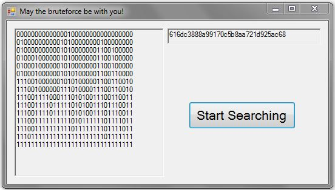

#The Attack
The provided "LosT.exe" gets as input a key with length 32 characters{0-9,a-f}. For each wrong character on the key, the output is '0' and for each right is '1' just like the image above.   To crack this key we need to change every character until its output is '1'. I coded in c# a bruteforcer to do this job.  
Key combination: 616dc3888a99170c5b8aa721d925ac68 
## The source code is [HERE](https://github.com/FournarakisKostas/CTF/tree/master/Juniors-CTF/BruteForcer)
